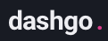

<h1 align="center">
  
</h1>

  <a href="#-tecnologias">Tecnologias</a>&nbsp;&nbsp;&nbsp;|&nbsp;&nbsp;&nbsp;
  <a href="#-projeto">Projeto</a>&nbsp;&nbsp;&nbsp;|&nbsp;&nbsp;&nbsp;
  <a href="#-solução">Solução</a>&nbsp;&nbsp;&nbsp;|&nbsp;&nbsp;&nbsp;
  <a href="#-como-executar">Como executar</a>&nbsp;&nbsp;&nbsp;|&nbsp;&nbsp;&nbsp;
  <a href="#-licença">Licença</a>

  

 

 

## ✨ Tecnologias

Esse projeto foi desenvolvido com as seguintes tecnologias:

- [ReactJS](https://reactjs.org)
- [TypeScript](https://www.typescriptlang.org/)
- [Next.js](https://nextjs.org)
- [Chakra-UI](https://chakra-ui.com)
- [React-Hook-Form](https://react-hook-form.com)
- [Yup](https://github.com/jquense/yup)
- [MirageJS](https://miragejs.com)
- [React Query](https://react-query.tanstack.com)

## 💻 Projeto

O dashgo é uma aplicação de dashboard desenvolvida durante o capítulo 4 do Ignite de ReactJS.

## 💡 Solução

Nessa aplicação foram explorados vários conceitos importantes como:

- [x] chakra-ui para construção de interfaces responsivas
- [x] react-hook-form para manipular formulários
- [x] yup para validação de dados de formulários
- [x] API Fake com o MirageJs
- [x] Paginação de consultas com o React Query
- [x] Cache de consultas com o React Query
- [x] Mutations com React Query
- [x] SSR com React Query
- [x] Autenticação e Autorização
- [x] Refresh Token

Além de tudo isso, eu adicionei algumas melhorias ao projeto inicialmente proposto durante o Ignite:

- [x] Configuração do editorconfig e prettier do projeto.
- [x] Criação do README 
- [x] Mudança na responsividade para o botão de editar se adaptar a diferentes tamanhos de tela

## 🚀 Como executar

- Clone o repositório
- Instale as dependências com `yarn`
- Inicie o servidor com `yarn dev`

Agora você pode acessar [`localhost:3000`](http://localhost:3000) do seu navegador.

Para testar a autenticação e autorização no dashgo, é necessário baixar [esse projeto](https://github.com/rocketseat-education/ignite-reactjs-auth-backend) de backend e executá-lo. O MirageJS não se dá bem com requisições chegando do mesmo domínio, o que vai ser o caso quando utilizarmos o backend de autenticação/autorização. Por isso, para testar essa parte especificamente é necessário comentar no `_app.tsx` a chamada ao `makeServer` que configura o MirageJS.

## 📄 Licença

Esse projeto está sob a licença MIT.

---
